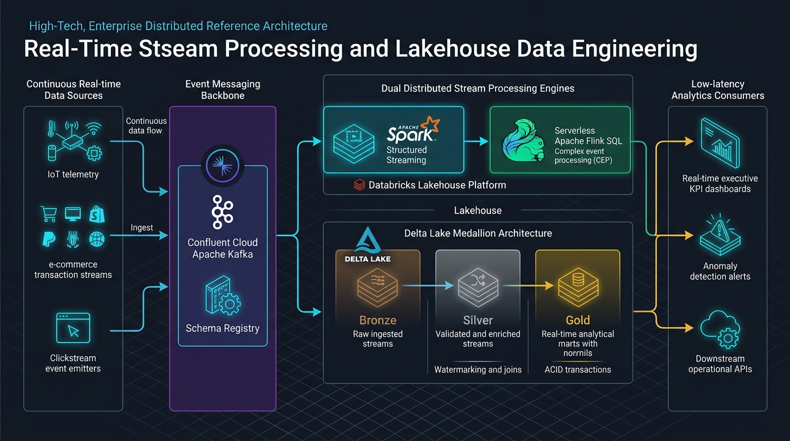
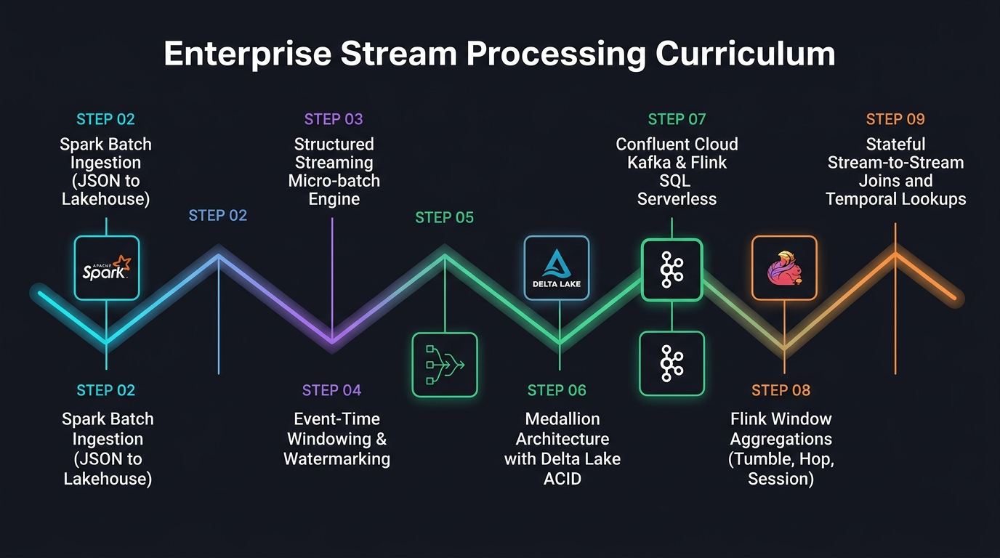

# Enterprise Real-Time Stream Processing & Lakehouse Architecture Blueprint

[](https://www.fiap.com.br/mba/mba-em-engenharia-de-dados/)
[](https://github.com/rafaelmatsuyama/FIAP-ABD-StreamProcessingPipelines/releases)


> **Official reference architecture and interactive hands-on lab suite developed for the [MBA em Engenharia de Dados](https://www.fiap.com.br/mba/mba-em-engenharia-de-dados/) at FIAP.**  
> *Covering Apache Spark Structured Streaming, Delta Lakehouse Medallion Architecture, Confluent Cloud Kafka, and Serverless Apache Flink SQL.*

---



---

## 🎯 Executive Overview & The Paradigm Shift

In modern data-driven enterprises, batch processing paradigms face the **Latency Barrier**: traditional nightly ETL pipelines cannot react to fraud anomalies, dynamic supply chain disruptions, or real-time user behavior within actionable time windows. Conversely, naive streaming implementations often suffer from state store bloat, out-of-order event drift, lack of ACID transactional guarantees, and operational maintenance overhead.

This repository establishes an end-to-end, production-grade **Reference Architecture** bridging high-throughput distributed stream ingestion with low-latency complex event processing (CEP). By converging **Apache Spark Structured Streaming on Databricks** with **Serverless Apache Flink SQL on Confluent Cloud**, this blueprint demonstrates how enterprise organizations build resilient, self-healing, and event-driven data streaming platforms.

### The Four Architectural Pillars:

1. **Unified Stream & Batch Abstraction:** Leveraging the Spark Catalyst Optimizer to execute continuous stream transformations using identical DataFrame APIs, enforcing deterministic micro-batch execution and end-to-end fault tolerance via write-ahead logging and checkpointing.
2. **ACID Lakehouse Medallion Architecture:** Implementing Bronze (raw immutable event ingest), Silver (cleansed, watermarked, schema-enforced, and enriched streams), and Gold (real-time analytical aggregations) layers backed by Delta Lake transactional logs and zero-loss streaming sinks.
3. **Managed Event Backbone & Schema Governance:** Utilizing Confluent Cloud Apache Kafka as the high-availability event spine, decoupling asynchronous producers from downstream stateful consumers with centralized Schema Registry governance.
4. **Sub-Second Stateful Complex Event Processing (CEP):** Employing Apache Flink SQL for native event-time windowing (Tumbling, Hopping, Session, Cumulative) and real-time stateful joins (Interval Joins, Temporal Table lookups) over dynamic continuous streams.

---

## 🏗️ End-to-End Architectural Flow



### Lifecycle Architecture Matrix

| Stage | Architectural Phase | Domain Responsibility & Core Actions | Standards & Technology Stack | Production Guarantees & Deliverables |
| :---: | :--- | :--- | :--- | :--- |
| **0** | **Upstream Event Producers** | Continuous emission of operational telemetry, financial transactions, and user clickstreams. | JSON Payloads, REST APIs, IoT Emitters | High-velocity raw event streams with distributed timestamps |
| **1** | **Batch Baseline & Ingestion** (Lab 02) | Exploratory analysis, schema inference, schema validation, and baseline batch ingestion into the Lakehouse. | PySpark, Spark SQL, Databricks Data Lake | Structured baseline DataFrames, schema verification, and batch analytical baseline |
| **2** | **Structured Streaming & State** (Labs 03, 04, 05) | Transitioning from batch to continuous micro-batches, window aggregations, watermarking late events, and static dimension enrichment. | PySpark Structured Streaming, Event-Time Watermarking, Broadcast Joins | Checkpointed fault-tolerant streaming queries, bounded state stores, and enriched streaming DataFrames |
| **3** | **Lakehouse Medallion Pipeline** (Lab 06) | Ingesting raw JSON into Bronze Delta, validating and enriching into Silver Delta, and aggregating into Gold Delta tables. | Delta Lake 3.x, ACID Transaction Log, PySpark Streaming Sinks | Multi-hop Medallion architecture with schema enforcement, ACID guarantees, and zero-loss checkpointing |
| **4** | **Serverless Stream SQL & Joins** (Labs 07, 08, 09) | Creating Kafka stream tables, computing temporal aggregations, and executing stateful stream-to-stream and temporal lookups. | Confluent Cloud Kafka, Apache Flink SQL Serverless | Sub-second event-driven materialized views, interval joins, and temporal fraud/anomaly detection |

---

## 🧪 Modular Hands-on Lab Suite

The repository is organized into 8 self-contained, sequential hands-on laboratories. Each module tackles a specific enterprise data engineering challenge:

| Module | Guides / Roteiros | Enterprise Pain Point | Technical Solution & Modern Stack | Technical Tags | Key Deliverable & Artifact |
| :--- | :--- | :--- | :--- | :--- | :--- |
| [`lab02-spark-batch`](./lab02-spark-batch) | [🇧🇷 PT-BR](./lab02-spark-batch/Lab%2002%20-%20Roteiro%20Aluno.md) \| [🇺🇸 EN](./lab02-spark-batch/Lab%2002%20-%20Student%20Guide.md) | Unpredictable nested JSON structures and lack of schema enforcement in batch ingestion | PySpark DataFrame schema projection and Spark SQL transformations on Databricks | `batch`, `pyspark`, `json-ingestion`, `data-lake` | Clean analytical DataFrames, baseline metrics, and Databricks execution notebook |
| [`lab03-spark-streaming`](./lab03-spark-streaming) | [🇧🇷 PT-BR](./lab03-spark-streaming/Lab%2003%20-%20Roteiro%20Aluno.md) \| [🇺🇸 EN](./lab03-spark-streaming/Lab%2003%20-%20Student%20Guide.md) | High latency of batch jobs unable to process arriving data within business SLA windows | PySpark Structured Streaming micro-batch engine with file-source streaming triggers | `structured-streaming`, `readstream`, `writestream`, `micro-batch` | Active streaming query with memory/console sink and continuous file monitoring |
| [`lab04-windowing-watermarking`](./lab04-windowing-watermarking) | [🇧🇷 PT-BR](./lab04-windowing-watermarking/Lab%2004%20-%20Roteiro%20Aluno.md) \| [🇺🇸 EN](./lab04-windowing-watermarking/Lab%2004%20-%20Student%20Guide.md) | Out-of-order events and network latency causing unbound state store explosion | Event-time windowing (`window`) combined with heuristic watermarking (`withWatermark`) | `tumbling-window`, `watermarking`, `event-time`, `late-data` | Windowed temporal aggregation with bounded memory and late-arrival handling |
| [`lab05-stream-enrichment`](./lab05-stream-enrichment) | [🇧🇷 PT-BR](./lab05-stream-enrichment/Lab%2005%20-%20Roteiro%20Aluno.md) \| [🇺🇸 EN](./lab05-stream-enrichment/Lab%2005%20-%20Student%20Guide.md) | Real-time streams lack master context (e.g. customer name, product category) for downstream decisions | Real-time static-to-stream joins with Broadcast Hash Join optimizations | `stream-enrichment`, `static-stream-join`, `broadcast-join` | Unified enriched stream outputting dimensional analytics in continuous micro-batches |
| [`lab06-medallion-delta`](./lab06-medallion-delta) | [🇧🇷 PT-BR](./lab06-medallion-delta/Lab%2006%20-%20Roteiro%20Aluno.md) \| [🇺🇸 EN](./lab06-medallion-delta/Lab%2006%20-%20Student%20Guide.md) | Inability to guarantee ACID transactions, concurrent writes, and schema evolution in streaming storage | Multi-hop Medallion Architecture (Bronze $\rightarrow$ Silver $\rightarrow$ Gold) using Delta Lake | `medallion-architecture`, `delta-lake`, `acid-transactions`, `lakehouse` | Production-grade 3-tier streaming Lakehouse with checkpointed ACID guarantees |
| [`lab07-confluent-flink-sql`](./lab07-confluent-flink-sql) | [🇧🇷 PT-BR](./lab07-confluent-flink-sql/Lab%2007%20-%20Roteiro%20Aluno.md) \| [🇺🇸 EN](./lab07-confluent-flink-sql/Lab%2007%20-%20Student%20Guide.md) | Complex infrastructure footprint and JVM operations overhead for managing Flink clusters | Serverless Apache Flink SQL on Confluent Cloud with integrated Schema Registry | `confluent-cloud`, `apache-kafka`, `flink-sql`, `serverless` | DDL-defined streaming tables, continuous queries, and real-time Kafka topics |
| [`lab08-flink-windowing`](./lab08-flink-windowing) | [🇧🇷 PT-BR](./lab08-flink-windowing/Lab%2008%20-%20Roteiro%20Aluno.md) \| [🇺🇸 EN](./lab08-flink-windowing/Lab%2008%20-%20Student%20Guide.md) | Need for sophisticated temporal aggregations across shifting and overlapping time horizons | Advanced Flink SQL Windowing TVFs (TUMBLE, HOP, SESSION, and CUMULATE) | `window-aggregation`, `tumble`, `hop`, `session`, `cumulate` | Production windowed analytical queries computing real-time velocity and volume KPIs |
| [`lab09-flink-joins`](./lab09-flink-joins) | [🇧🇷 PT-BR](./lab09-flink-joins/Lab%2009%20-%20Roteiro%20Aluno.md) \| [🇺🇸 EN](./lab09-flink-joins/Lab%2009%20-%20Student%20Guide.md) | Joining two unbounded asynchronous event streams without infinite state retention | Stateful Stream-to-Stream Interval Joins and Temporal Table Lookups (`FOR SYSTEM_TIME AS OF`) | `stream-stream-join`, `interval-join`, `temporal-table-join`, `stateful-streaming` | Sub-second order-to-shipment correlation and temporal fraud detection engine |

---

## 🚀 Quickstart Guides (Zero-Friction Bootstrap)

### Track A: Apache Spark & Delta Lakehouse (Labs 02 - 06)

Labs 02 through 06 run on **Databricks Free Edition / Community Edition** or any Apache Spark 3.5+ cluster:

1. **Access Databricks:**
   - Sign up or log in to [Databricks Community Edition](https://community.cloud.databricks.com/) or your enterprise Databricks workspace.
2. **Create a Compute Cluster:**
   - Single Node, Runtime 14.3 LTS (or latest Spark 3.5.x with Scala 2.12/2.13).
3. **Import Notebooks:**
   - In Databricks Workspace, navigate to your user folder $\rightarrow$ `Import`.
   - Select the target `.ipynb` notebook from the corresponding lab folder (e.g., [`lab02-spark-batch`](./lab02-spark-batch) or [`lab06-medallion-delta`](./lab06-medallion-delta)).
4. **Attach and Run:**
   - Follow the instructions in the bilingual guide ([`Lab XX - Student Guide.md`](./lab02-spark-batch/Lab%2002%20-%20Student%20Guide.md) or [`Lab XX - Roteiro Aluno.md`](./lab02-spark-batch/Lab%2002%20-%20Roteiro%20Aluno.md)).

### Track B: Confluent Cloud & Serverless Flink SQL (Labs 07 - 09)

Labs 07 through 09 run serverless on **Confluent Cloud**:

1. **Access Confluent Cloud:**
   - Navigate to [Confluent Cloud](https://confluent.cloud/) and create a free trial account (includes $400 in initial credits).
2. **Provision Environment:**
   - Create an Environment (e.g., `FIAP-MBA-Streaming`) and a Kafka Cluster (Standard or Basic tier, AWS/GCP region).
3. **Launch Flink Compute Pool:**
   - In the cluster overview, click on **Flink** $\rightarrow$ Create Flink Compute Pool (1-2 CFUs).
4. **Execute Streaming SQL:**
   - Open the **Flink SQL Workspace** editor and run the DDL and streaming queries provided in Labs 07, 08, and 09.

---

## ⚙️ Key Architectural Patterns & Production Hardening

This reference implementation incorporates critical engineering lessons learned in high-throughput enterprise deployments:

* **Checkpoint Directory Integrity & Exact-Once Recovery:**
  In PySpark Structured Streaming, every streaming sink must define an immutable `checkpointLocation`. This directory houses the write-ahead transaction log, commit offset logs, and state storage. In production, this path must reside on highly available, object-store compatible storage (e.g., ADLS Gen2, AWS S3, or GCS) with atomic rename or direct put capabilities.
* **Watermark Drift vs. State Explosion Trade-offs:**
  Setting a watermark too short drops valid delayed events, compromising analytical accuracy. Setting it too long forces Spark's state store (or Flink's RocksDB state backend) to retain unbounded event keys in memory, causing executor OutOfMemory (OOM) failures. Production pipelines tune watermarks to match empirical p99.9 arrival latencies.
* **Broadcast Join Optimization in Dynamic Streaming:**
  When joining high-velocity streams with dimensional lookup tables (Lab 05), standard shuffle joins create massive network I/O bottlenecks. Using `broadcast(static_df)` distributes the dimensional table across all executor memory blocks, enabling zero-shuffle local lookups.
* **Delta Lake File Pruning & Compaction (`OPTIMIZE` / `VACUUM`):**
  Continuous micro-batch writing to Delta Lake sinks generates thousands of small Parquet files over time (the "Small File Problem"). Production 24/7 streaming engines execute scheduled `OPTIMIZE delta.`/`path` Z-ORDER runs alongside controlled `VACUUM` commands to prune obsolete transaction log snapshots while maintaining time-travel capabilities.
* **Flink SQL State Retention & Idle State TTL:**
  Unbounded stream-to-stream joins without time constraints retain keys indefinitely. In production Flink SQL environments, engineers must configure `table.exec.state.ttl` (e.g., `'12h'` or `'24h'`) to ensure that stale keys are evicted automatically by the RocksDB state manager, preventing persistent state corruption.

---

## 🎓 Academic Validation & Field Hardening

This framework and interactive lab suite were architected, refined, and battle-tested by **Rafael Matsuyama** as part of the **Stream Processing & Pipelines** curriculum for the **Executive MBA in Data Engineering at FIAP** (São Paulo, Brazil).

Senior data engineers, solutions architects, and analytics leaders across enterprise cohorts have executed, validated, and stress-tested these scenarios, providing continuous feedback to ensure that every laboratory reflects real-world corporate streaming workloads.

---

## 🏷️ Release Cadence & Versioning Policy

This repository follows a strict **Calendar Versioning with Cycle and Patch semantics (CalVer)** (`vYYYY.CYCLE.PATCH`) to balance enterprise technical stability with annual executive curriculum delivery:

```
  v2026 . 1 . 0
    │     │   │
    │     │   └── PATCH: Hotfixes, dependency bumps & documentation errata
    │     └────── CYCLE: Major content iterations or new lab modules
    └──────────── YEAR:  Annual technology stack baseline & MBA curriculum edition
```

* **Deterministic Reproducibility:** Each tagged release provides an immutable snapshot where all laboratory notebooks, scripts, guides, and SQL statements are validated to execute deterministically without runtime drift.
* **Academic Cohort Pinning:** Students from specific cohort years or corporate teams standardizing on past editions can pin their environment directly to the official release tag:
  ```bash
  git checkout tags/v2026.1.0
  ```
* All milestone releases and automated release notes are available on the official [GitHub Releases](https://github.com/rafaelmatsuyama/FIAP-ABD-StreamProcessingPipelines/releases) page.

---

## 👨‍💻 Author & Leadership

**Rafael Matsuyama**  
*Solutions Architect & Data Engineering Specialist*  
Engineering graduate from **Escola Politécnica da Universidade de São Paulo (Poli-USP)** with over two decades of experience across Cloud Architecture, Distributed Systems, Mission-Critical Platforms, and Academic Leadership.

* 🌐 **LinkedIn:** [linkedin.com/in/rafaelmatsuyama](https://www.linkedin.com/in/rafaelmatsuyama)
* 🐙 **GitHub:** [github.com/rafaelmatsuyama](https://github.com/rafaelmatsuyama)

---

## 📜 Dual Licensing Model

This repository employs a **dual-licensing structure** to encourage enterprise adoption of the codebase while protecting educational materials from unauthorized commercial resale:

* 💻 **Code, Scripts & Notebooks (`*.ipynb`, `*.py`, `*.sql`, `*.json`):** Licensed under the **[Apache 2.0 License](LICENSE)**. Permissive and free to be used, adapted, and integrated into enterprise production environments.
* 📚 **Educational Content & Manuals (`*.md` lab guides, guides, diagrams):** Licensed under **[Creative Commons Attribution-NonCommercial-ShareAlike 4.0 International (CC BY-NC-SA 4.0)](https://creativecommons.org/licenses/by-nc-sa/4.0/)**. Free for personal learning, study, and educational reference; commercial reproduction, selling, or course packaging by third parties is strictly prohibited.
